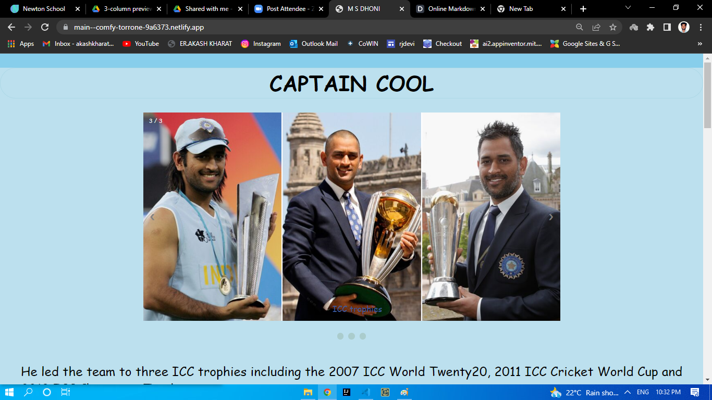

## Tribute_To_MS_DHONI
-  This repo is a collection of html and css code of my Project 1 the Tribute website in Newton School.. 
  You can find the deployment [here.]
-  This Website is tribute to the great Indian Cricketer Captain M. S. Dhoni. India won the 3 titles of ICC cricket under his captaincy. The most popular franchise cricket league in the World IPL, Under his captaincy the Chennai Superking team won the league 4 times.  You can find te wikipedia page of the [M. S. Dhoni] here.
 
 [//]: #
  [here.]:<https://main--comfy-torrone-9a6373.netlify.app/>
  [M. S. Dhoni]:<https://en.wikipedia.org/wiki/MS_Dhoni>
 
 ## The page is looks like this
 
